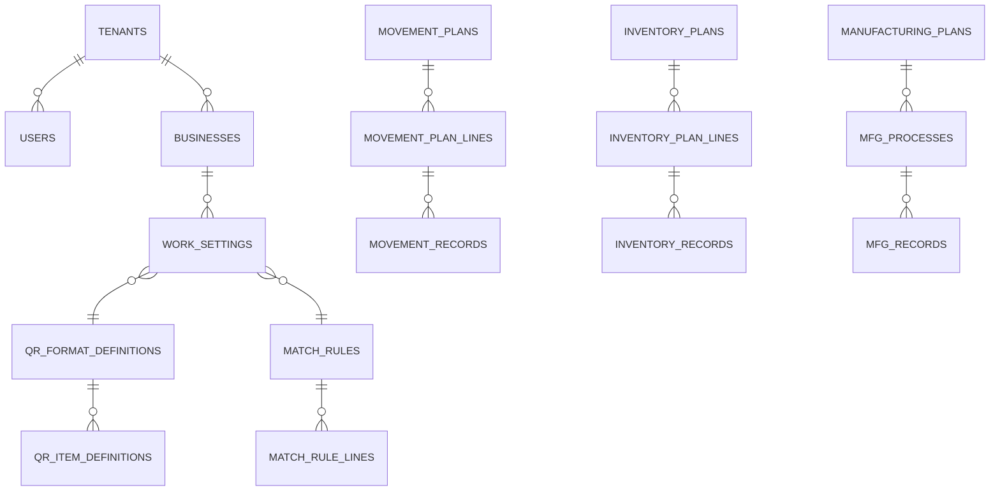

# GENBA Architecture

作成日: 2026-05-10 / Phase 0
依存: `PRODUCT_SPEC.md`、`config/tech-stack.yaml`、`config/approval-rules.yaml`

## 1. 全体構成

```mermaid
flowchart LR
  CL[PWA / Next.js 15<br/>+ @zxing + idb] -->|@supabase/ssr| AU[Supabase Auth/JWT]
  CL --> APP[Next.js Server]
  APP -->|service role| DB[(Postgres + RLS)]
  CL -->|anon + JWT| DB
  APP --> EF[Edge Fn<br/>CSV取込/出力]
  EF --> DB
  APP --> ST[Storage 30日]
```

スタック (tech-stack.yaml): Next 15 App Router + TS 5.7 + Tailwind v4 + shadcn + Zustand + react-hook-form + zod + `@zxing/browser` + `idb` (P2)、Supabase (Auth/Postgres/EF/Storage)、Vercel hosting。Sentry は approval 必須。client は anon JWT で RLS 経由直書き、CSV 取込・月次集計など重い処理は EF。

## 2. ドメインモデル



カテゴリ: マスタ (`businesses`/`work_types`/`processes`/`equipment`/`defect_groups`/`defects`) / ユーザー (`users`=作業者, `tenants`, `tenant_subscriptions`) / 設定 (`standard_field_definitions`/`tenant_field_settings`/`custom_field_definitions`/`qr_format_definitions`/`qr_item_definitions`/`match_rules`/`match_rule_lines`/`csv_import_*`/`csv_export_*`/`work_settings`/`work_input_field_settings`) / 業務 (LOGI: `movement_*`/`inventory_*` / WORKS: `manufacturing_*`) / 履歴 (`qr_scan_histories`)。

共通列: `id`, `tenant_id`, `created_at/by`, `updated_at/by` (Phase 1 から監査用), `deleted_at`、必要に応じ `custom_text_01..10`/`custom_number_01..05`/`custom_date_01..05`。実績は `previous_record_id` を持ち、訂正は新 INSERT+旧行 `deleted_at` で表現 (UPDATE 上書き禁止)。

## 3. 4 業務状態遷移

```mermaid
stateDiagram-v2
  [*] --> SelectWork
  SelectWork --> SelectWorker
  SelectWorker --> ReadHeader: ticket
  SelectWorker --> ReadLabel: free
  ReadHeader --> ReadLine --> ReadLabel
  ReadLabel --> Match: double
  ReadLabel --> Input: none
  Match --> Input: OK
  Match --> NgWarn: warn
  Match --> NgBlock: block
  NgWarn --> Input
  NgBlock --> ReadLabel
  Input --> Submitted
  Submitted --> SelectWork
```

入庫・ピッキング上記。**棚卸**: `SelectInventoryPlan→ReadLocation→ReadLabel→CheckLine→InputQty→Submitted` 繰返。**製造**: `ReadInstruction→StartChoice→Started→Producing→Ended→InputResult→AddDefect*→Submitted→ProduceInflow?`。

## 4. QR / CSV / 認可

**QR**: `qr_format_definitions(tenant_id, qr_type, version)` UNIQUE。`readable` (旧版読取可) と `issuable` (発行候補) を分離。`qr_item_definitions.position→target_column` で `parsed_values` (jsonb) を作り `qr_scan_histories` に保存。**照合は解析後の項目コード** で `match_rule_lines` を引き、QR 版差の影響を受けない。詳細→`QR_SPEC.md`。

**CSV 取込** (Phase 3 DoD): Storage (`imports/<tenant>/<uuid>.csv`、30 日)→EF で `csv_import_definitions` 解析→INSERT。Content-Type 強制 (`text/csv`/xls)、サイズ 10 MB、行数 100k、ファイル名は server 側 UUID 付替 (path traversal 防御)。

**CSV 取込 実装状況 (Phase 3b 以降)**: 現行 EF (`supabase/functions/{movement,inventory}-csv-import`) は Phase 3b で採用された inline body stream 方式で request body を直接受け取り解析する。上記 Storage UUID-rename ラウンドトリップは Phase 4+ の将来拡張ポインタ (10 MB 超のチャンク投入や非同期リトライが必要になった時点で再導入する設計余地) として残している。`csv_import_jobs.source_storage_path` は caller-supplied の監査メタデータ専用カラムで、現時点ではいかなる read 経路も持たない (したがって path traversal 攻撃面は実装上発生しない)。

**CSV 出力**: 履歴の絞込を server action で受け `csv_export_definitions` で stream 返却。shift_jis は EF で `iconv-lite`。**Formula injection 防御**: 各セルが `=`/`+`/`-`/`@`/`\t`/`\r` 始まりなら先頭 `'` prepend、unit test 必須。

**RLS / RBAC**: `anon` (login のみ) / `authenticated + role='worker'` / `authenticated + role='tenant_admin'` / `service_role` (server only)。JWT への `tenant_id`/`role` 投入は **必ず `raw_app_meta_data`** (`raw_user_metadata` は client SDK で書換可ゆえ禁止)。Phase 1 DoD: `raw_user_metadata` 書込 grep 0 hit。

```sql
-- T=tenant_id=(auth.jwt()->>'tenant_id')::uuid, R=auth.jwt()->>'role'
ALTER TABLE movement_records ENABLE ROW LEVEL SECURITY;
CREATE POLICY sel ON movement_records FOR SELECT USING (tenant_id=T);
CREATE POLICY ins ON movement_records FOR INSERT
  WITH CHECK (tenant_id=T AND worker_id=auth.uid());
CREATE POLICY upd ON movement_records FOR UPDATE
  USING (tenant_id=T AND (worker_id=auth.uid() OR R='tenant_admin'));
CREATE POLICY del ON movement_records FOR DELETE
  USING (tenant_id=T AND R='tenant_admin');
```

運用設定テーブルは I/U/D を `tenant_admin` のみに制限。

**RLS テスト** (Phase 1 必須、SECURITY-AUDIT 対応): RLS-001 T2→T1 SELECT=0 / -002 worker `work_settings` INSERT=0 / -003 worker `worker_id=他` INSERT=0 / -004 `UPDATE..tenant_id=他`=0 / -005 client に service_role grep=0 / -006 A→B record UPDATE=0 / -007 `target_id` 他テナント uuid=0 (trigger) / -008 `raw_user_metadata` 書込 grep=0。

## 5. リスク

R-01 多 RLS の SELECT 遅延→Phase 4 EXPLAIN+部分 index / R-02 `qr_scan_histories` 爆発→Phase 6 で partition or archive / R-03 iOS `getUserMedia`→手入力 fallback / R-04 shift_jis 失敗→EF+`iconv-lite`+5 サンプル / R-05 `target_table+id` ポリモーフィック FK 不可→Phase 3 `validate_target_tenant()` trigger (RLS-007、P1 前倒し) / R-06 `custom_text_01` 意味不明→`tenant_field_settings` API 一本化 / R-07 V1/V2 照合崩れ→解析後の項目コードで照合 / R-08 `readable=false` 誤操作→UI 使用件数+確認ダイアログ。
