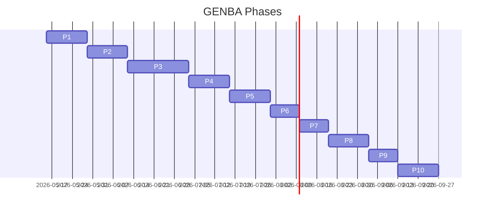

# GENBA Implementation Plan (Phase 1〜10)

作成日: 2026-05-10 / Phase 0、改訂: 2026-05-11 Phase 1 キックオフ承認反映
承認状況: **`full_implementation_kickoff` 承認済み (owner: oi.hironori, 2026-05-11)** → Phase 1 (Scaffolding + Auth + RLS) 着手中。**Supabase project の新規作成と `.env.enc` への secret 登録は owner 作業として並行進行** (本書時点では client/server コードに env var 名のみ参照、secret 値は別管理)。

## 0. 全体マップ

**MVP**=Phase 4 完 (1 顧客)、**Beta 卒業**=Phase 7 完 (3〜5 顧客運用)、**GA**=Phase 9〜10。**強制 cut line=Phase 4**。1 turn ≈ worker の 1 ラウンド (壁時計 5〜15 分)。

## 1. Phase 1〜10

### Phase 1 基盤+Auth+RLS (14 日 / **180 turn** / **二重監査必須**) — **owner 承認 full_implementation_kickoff 済 (2026-05-11)**
scaffold、Next 15+Tailwind v4+shadcn、tokens (OKLCH、OS-following dark via `prefers-color-scheme`、Phase 1 では手動トグル無し)、Supabase 新規プロジェクト作成は **owner 側で並行作業** (本 dispatch では `.env.enc` を編集しない / secret を作成しない)、Auth (login / password reset request / callback / logout、パスワード min 10 文字 zod、role 変更時 service_role で refresh token revoke)、初期 migration (tenants / profiles / tenant_subscriptions / businesses seed:4 / 共通 audit columns)、RLS テンプレ、`raw_app_meta_data` への `tenant_id`/`role` 投入 EF (server-only)、AppShell、Vitest+Playwright、SOPS+age `.env.enc` (owner 管理)。
**DoD**: build/lint/vitest/Playwright pass、RLS-001〜008、`created_by`/`updated_by` 全テナント所有テーブル導入 (audit/timing P1)、`raw_user_metadata` 書込 grep 0 hit (auth/jwt P1)、`service_role` が client bundle に grep 0 hit、**security-auditor pass/conditional**、SECURITY-AUDIT 生成、WCAG、CLAUDE.md。
**リスク**: RLS 再帰 (pick-checker 教訓→`auth.jwt()` のみ) / Supabase project 受領遅延 (owner 並行作業) / Tailwind v4 API 変更。

### Phase 2 マスタ+項目+QR 定義 (14 日 / **160 turn**)
設定系+マスタ系 migration、項目設定 (利用 ON/OFF+5 用途)、QR 設定+読取テスト、照合ルール、parser library、seed。
**DoD**: QR_SPEC §8 T01〜T10 unit pass、V1/V2 同時解析 Playwright 1 本、項目→QR→照合の遷移、reviewer pass。

### Phase 3 LOGI 入庫/ピッキング/棚卸 (21 日 / **240 turn** / **二重監査必須**)
`movement_*`/`inventory_*`/`qr_scan_histories`/LOGI CSV seed/`work_settings` migration、3 業務画面、Scanner/ResultOverlay/StepHeader、CSV 取込 EF、出力 (shift_jis/utf8)、履歴。
**DoD**: 3 業務 e2e、`ng_flow=block/warn`、CSV 取込 各 1 サンプル+エラー行 `csv_import_jobs.errors`、**Content-Type/10MB/100k 行 server reject** (csv/injection P1)、**formula injection** `=+-@\t\r` 先頭 `'` prepend unit test (csv/injection P1)、**`validate_target_tenant()` trigger+RLS-007** (rls/polymorphic_fk P1 前倒し)、**`raw_value` は tenant_admin のみ** (column-level RLS or view、qr/raw_value_exposure P1)、履歴絞込、WCAG+56×56、**security-auditor pass**。
**リスク**: iOS getUserMedia / shift_jis 5 サンプル / 棚卸差異 view `v_inventory_diff` / `qr_scan_histories` 急増 → `(tenant_id, created_at)` index。

### Phase 4 WORKS+MVP (14 日 / **160 turn** / **二重監査必須**)
`manufacturing_*` migration、製造画面 (指示 QR→工程→開始/終了→製造数/ロット/設備→不適合 N→登録)、製造入庫同時記録、4 業務統合履歴、MVP 準備 (1 顧客 seed、Vercel 本番=**production_deploy 承認必須**、**Supabase Pro+PITR を MVP 本番稼働開始時に有効化=`paid_subscription_signup` 承認は Phase 3 末/Phase 4 着手前に取得**、SLA 99.5%、`docs/RUNBOOK.md`)。
**DoD**: 製造 e2e、PRODUCT_SPEC §6 全 AC、本番デプロイ承認、PITR 有効、**security-auditor pass**、RUNBOOK。
**リスク**: 不適合 N の UI ページング / 製造入庫二重記録 (`manufacturing_record_id` UNIQUE) / k6 軽量検証 (100 同時)。

### Phase 5 マスタ UI+訂正+個人設定 (14 日 / **140 turn**)
マスタ CRUD (5 種)、訂正 UI、個人設定、ユーザー設定、カスタム項目意味付け UI。
**DoD**: マスタ CRUD e2e×5、訂正 e2e (前 ID リンク)、PW 変更、reviewer pass。

### Phase 6 テナント管理+上限 (10 日 / **100 turn** / **二重監査必須**)
システム管理者画面、`tenant_subscriptions` (利用業務/ユーザー上限/月間スキャン上限)、月次集計 EF cron、80% 到達バナー、上限チェック。
**DoD**: テナント新規→招待→初回ログイン e2e、上限超過警告、**security-auditor pass** (system_admin 境界+tenant_subscriptions クロステナント)。

### Phase 7 履歴強化+コード照合+監査 (10 日 / **100 turn**)
QR 履歴詳細、コード照合 (帳票チェック)、`audit_logs`+trigger、履歴 CSV 出力。
**DoD**: コード照合 e2e、設定変更で audit_logs 増加、項目別差分可視化。

### Phase 8 オフライン (14 日 / **160 turn** / **二重監査必須**)
SW、IDB キュー、復帰時自動同期+競合解決、未同期 chip、オフライン UI 明示。
**DoD**: 切断→読取+登録→復帰→同期 e2e、競合冪等化、**security-auditor pass** (IDB の PII/認証情報)。
**リスク**: SW キャッシュバグ→画面別 cache-first/network-first / IDB に PII 残さない (同期成功で即削除、ログアウトで全削除、認証情報は保存しない)。

### Phase 9 性能+バックアップ+観測 (10 日 / **100 turn**)
履歴/`qr_scan_histories` チューニング、Sentry 検討 (**承認必須**) or OTel、月次バックアップ+リストア手順 (PITR は Phase 4 で先行有効化済み、本フェーズではリストア演習とアラート閾値の整備に注力)。
**DoD**: 履歴クエリ < 1.5s (10k 行)、staging リストア成功、reviewer pass。

### Phase 10 多言語+GEN 連携+GA (14 日 / **140 turn**)
i18n、GEN 連携 (REST/SFTP)、GA 確認 (WCAG/4 業務 e2e/SECURITY-AUDIT P0=0/RUNBOOK/本番運用 1 ヶ月以上)。
**DoD**: GA 承認 (owner+代表顧客)、`docs/GA-CHECKLIST.md` 全パス。

## 2. 二重監査サマリ

**必須**: Phase 1 (auth+RLS) / Phase 3 (RLS 拡張+多テナント境界) / Phase 4 (RLS+production_deploy) / Phase 6 (system_admin 境界+tenant_subscriptions) / Phase 8 (IDB の PII)。Phase 2/7 推奨、Phase 5 スキップ可、Phase 9 は Sentry 導入時、Phase 10 は GEN 連携時。

## 3. turn / 所要時間まとめ

P1=14d/180、P2=14d/160、P3=21d/240、P4=14d/160、P5=14d/140、P6=10d/100、P7=10d/100、P8=14d/160、P9=10d/100、P10=14d/140 → **計 135 日 (約 4.5 ヶ月) / 1,480 turn**。並列ワーク+割込みで前後 30〜50% の幅。MVP (Phase 4) は実質 **8〜10 週間**。

## 4. 全体リスク

GR-01 機能整理.md/mock 不整合→Phase 1 冒頭で再確認 / GR-02 Phase 3 21 日超過→3a/3b 分割可 / GR-03 RLS bypass 指摘→Phase 1 で security-auditor とテンプレ確定 / GR-04 shift_jis 文字化け→5 サンプル+`iconv-lite` / GR-05 古い端末で zxing 不可→対応端末+手入力 / GR-06 テナント管理画面まで SQL 直叩き手順 `INTERIM-OPS.md` / GR-07 approval 遅延→着手前 owner 合意 / GR-08 月次集計遅延→Phase 6 で MV 日次更新。

## 5. 引き継ぎ

owner 承認済 (2026-05-11): `full_implementation_kickoff` 承認→Phase 1 payload を architect/frontend/backend/reviewer/security-auditor に分配→**Supabase 新規プロジェクト作成と `.env.enc` への secret 登録は owner 側で並行作業** (本実装では env var 名のみ参照し、secret 値の生成・編集は行わない)→designer は `workspace/design-library/` 追記。

Phase 3 末で `paid_subscription_signup` 承認 (Supabase Pro + PITR)、Phase 4 着手時に PITR を MVP 本番稼働前に有効化する流れ (Phase 9 ではなく Phase 3-4 境界に前倒し、Phase 0 owner レビュー 2026-05-11 で決定)。
