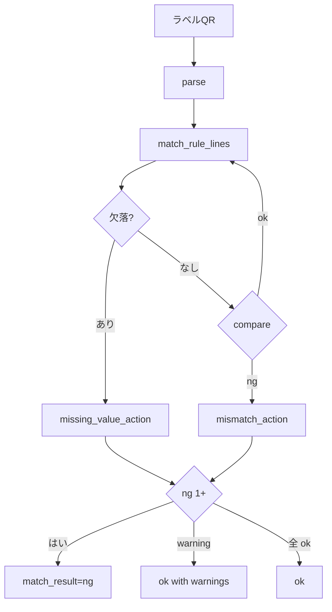

# GENBA QR Spec

作成日: 2026-05-10 / Phase 0
依存: `ARCHITECTURE.md` §2, §4、`research/genba-discovery/spec/GENBA_機能整理.md` §QR

## 1. 設計原則

(1) QR 本体に項目名を持たせない (`item_code=...` 禁止、バージョン値+区切り済データのみ) / (2) 定義と本体を分離→「どの V の何番目が何か」を DB 側で持ちラベル貼替不要 / (3) 照合は解析後の項目コードで実施し QR 版差の影響を受けない / (4) 3 種別 (header/line/label) を `qr_type` で区別し 1 テーブル。

## 2. 文字列フォーマット

`<VERSION><DELIM><DATA1>...<DELIM><DATAn>`。**VERSION**=先頭 `V1`/`V2`/`V10` (`V`+整数、最大 4 文字推奨)。**DELIM** は `qr_format_definitions.delimiter` で `comma`/`tab`/`pipe`/`other`。**DATAn** は `qr_item_definitions.position` (1 始まり)、空文字も有効 (`missing_value_action` 対象)。

例: ラベル V1 `V1|ITEM-2048|12|A-03-15|ORD-20260510|FACTORY-A|||` → 1=`item_code`/2=`quantity`/3=`location_code`/4=`order_no`/5=`customer_code`/6〜8 空。ヘッダ `V1|SHIP-018|2026-05-09|CUST-001`、明細 `V1|SHIP-018|3|ITEM-1102|4|LOT-A`。

**バージョン解釈**: (1) 先頭〜最初の delim を `version_token` 切出 / (2) 画面の作業設定で `qr_type` 決定 (QR 本体に含まない) / (3) `(tenant_id, qr_type, version_token)` で format 検索 / (4) 該当なし=`ng`+raw のみ INSERT / (5) `readable=false`=エラー。

## 3. payload schema

**`qr_format_definitions`**: `id`/`tenant_id`/`qr_type` (header/line/label) / `format_code`/`format_name`/`version` (UNIQUE: `tenant_id+qr_type+version`) / `delimiter`/`encoding`/`readable` (旧版読取可否) / `issuable` (発行候補) / `valid_from`。

**`qr_item_definitions`**: `id`/親 `qr_format_definition_id`/`position` (1 始まり) / `qr_item_name`/`target_column` (標準 or `custom_text_01`) / `required`/`data_type` (text/numeric/date) / `date_format`/`missing_value_action` (error/allow_blank)。**運用ルール**: `position` 変更は定義上書きせず **新バージョン追加**。

**解析結果 `parsed_values`** (jsonb、`qr_scan_histories` 保存): key=`target_column`、value=data_type に従い parse (text/number/`YYYY-MM-DD`)、空文字→`null`。例 `{"item_code":"ITEM-2048","quantity":12,"lot":null}`。

## 4. 2 点照合

- **`compare_type`**: `equals` (Unicode NFC) / `numeric_equals` (前置 0 許容)。将来 (P5+) `prefix_equals`/`regex_match`/`range_check`
- **`missing_value_action`**: `ng`/`warning`/`skip` / **`mismatch_action`**: `ng`/`warning`
- **`ng_flow`** (作業設定): `block` (登録 disabled) / `warn` (確認後続行) / `approve` (P2、リーダー承認)

**`match_detail`** (jsonb 配列): 各 line に `sort_order`/`line_field_code`/`label_field_code`/`source_value`/`label_value`/`compare_type`/`result`/`action_applied`。

## 5. バージョン管理

**新 V 必要**: 項目順変更 / 既存より前に挿入 / 区切り変更 / data_type 変更。**新 V 不要**: 末尾追加 (空読取が後方互換) / `qr_item_name` 表示変更 / `required` 変更。

**追加手順**: (1) QR 設定で種別選択 / (2)「新バージョン」で V(現+1) 作成+項目コピー / (3) 必要変更 / (4) `valid_from` 未来日 / (5) `issuable=true, readable=true` 保存 / (6) 到来までは V(旧) が `issuable=true` / (7) 到来後 V(新) が `issuable=true`、V(旧) は `issuable=false` (Phase 4 で cron EF、Phase 1 は手動切替)。

**旧 V 読取維持**: ラベル貼替が困難なため `deleted_at IS NULL` で残し `readable=true` 維持。月次 0 件が 6 ヶ月続いたら管理者確認で `readable=false` 検討。

**読取テスト** (Phase 1、mock にあり): 任意 QR を入力→`readable=true` 全 V で解析試行→「V1 成功 / V2 失敗 (理由)」を一覧。新 V 追加時に旧 QR が引き続き読めることを確認。

## 6. 種別ごとの紐付け

- `header` (`identify_header`) → `movement/inventory/manufacturing_plans` (ヘッダ確定時)
- `line` (`identify_line` / `match_source`) → `*_plan_lines` / `mfg_plan_processes` (明細確定時)
- `label` (`item_label`) → `movement/inventory/manufacturing_records` (実績登録後)

`qr_scan_histories` は読取成功で INSERT、`target_id` は実績登録後 UPDATE。`target_table+id` は **ポリモーフィック参照** (FK 不可)。
**Phase 3 必須**: `validate_target_tenant()` PG trigger を `qr_scan_histories` に設定。INSERT/UPDATE 時 `EXECUTE format('SELECT tenant_id FROM %I WHERE id=$1', target_table)` で動的 lookup し `tenant_id` 不一致は raise。`target_table` は許可リスト (records/plans/plan_lines/plan_processes) の CHECK 制約で SQL injection 経路を絶つ。テスト=ARCHITECTURE §4 RLS-007。

## 7. エラー / セキュリティ

**エラー**: 未登録 V / `readable=false` / 列数不足 / numeric/date parse 失敗 / 区切り混入 / 照合ルール未設定 → `qr_scan_histories` に raw 中心で INSERT、UI に具体メッセージ。

**セキュリティ (security-auditor)**: QR 文字列上限 4096 文字 server 検証 / 区切り文字 `\n`/`\0` 禁止+sanitize / `raw_value` SELECT に LIMIT / **`raw_value` は tenant_admin のみ SELECT 可** (column-level RLS or `v_qr_scan_histories_for_worker` view、worker は `parsed_values`+`match_detail` のみ、**Phase 3 DoD 必須**) / テナント境界 RLS / `target_id` 改ざん防御 (`validate_target_tenant()` trigger) / 個人情報を QR に入れない運用ルール / payload は zod で型/長さ/値域検証してから DB へ。

**target_tenant trigger の soft-delete 許容方針 (product decision)**: Summary — soft-deleted targets are accepted; scan record retains forensic value. `validate_target_tenant()` trigger (`supabase/migrations/20260512000300_phase3a_target_tenant_trigger.sql:57-62` の dynamic lookup) は参照先 target row の `tenant_id` 一致のみを検証し、`deleted_at IS NULL` は要件としない。つまり soft-deleted target を参照する scan も accept される。根拠は forensic 用途: ラベル貼替や誤運用、論理削除後の事後追跡などのインシデント調査で「いつ・誰が・どの (現在 soft-deleted な) target を読んだか」の scan record は forensic evidence として retain する価値があり、trigger 側で deleted 参照を拒否すると証跡を失う。本方針は `SECURITY-AUDIT-2026-05-12-phase3a` P2 `soft-delete-trigger-permissive` に対する product decision として明文化する (trigger code は変更しない)。

## 8. テストケース (Phase 1 TDD / Phase 4 再点検)

T01 parse `V1\|ITEM-A\|12\|A-03` pipe→4 項目 / T02 `V99\|...` 未登録→raw のみ INSERT / T03 numeric 期待に `abc`→key=null+エラー / T04 列数不足 8/5→後ろ 3=null、required=ng / T05 全項目 OK→ok / T06 item_code OK / lot 不一致→ng / T07 source null+missing=warning→ok with warning / T08 rule 未設定+match_mode=double→登録 block / T09 V1/V2 同時 readable で V1 読取→成功 / T10 V1 readable=false 後の V1 読取→エラー / T11 T2 で T1 の qr_format_definitions SELECT→0 / T12 raw_value 10000 文字→server reject。
